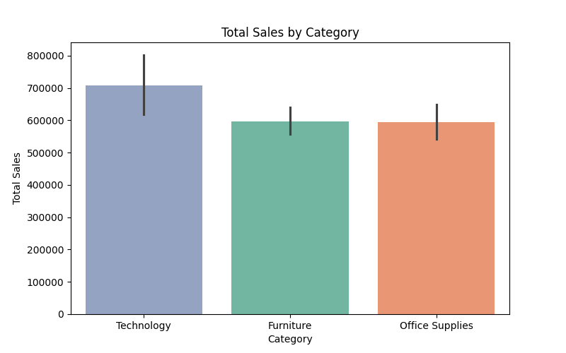
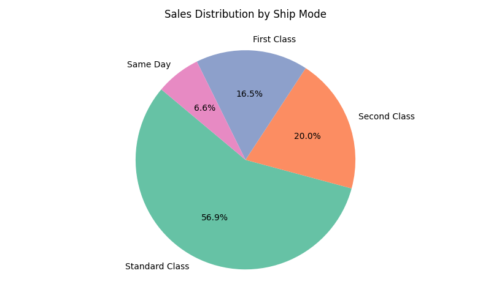

Superstore Sales Analysis (Python + Tableau) -

End‑to‑end data analysis project using Python (Pandas, Seaborn, Matplotlib) for cleaning & EDA and Tableau Public for an interactive dashboard.  
The goal is to surface actionable insights on sales performance by category, sub‑category, geography, segment, and shipping, and to demonstrate a clear analyst workflow.

Tableau Dashboard - 
    Live dashboard (Tableau Public): [[tableau dashboard](https://public.tableau.com/app/profile/tarek.khatib8857/viz/sales_dashboard_17554536951620/Dashboard1)]

Objectives -
    - Clean and standardize raw sales data for reliable analysis.
    - Perform EDA to understand distributions, trends, and outliers.
    - Build KPIs & pivot summaries for stakeholders.
    - Design and publish an interactive Tableau dashboard.

Dataset - 
    - Source: Sample Superstore retail dataset (public/educational - kaggle).
    - ~8K rows; columns include Orders, Customers, Category/Sub‑Category, Region/State/City, Ship Mode, Sales.

Data Cleaning Highlights - 
    •   Parsed and validated date fields (Order Date, Ship Date) with mixed formats.
	•	Trimmed/standardized categorical text; coerced numeric fields (e.g., Sales).
	•	Removed duplicates and rows with invalid shipping intervals.
	•	Ensured IDs treated as strings; standardized postal codes where applicable.

Key Insights (from EDA) - 
    •	Category performance: Technology drives the highest total sales, followed by Office Supplies and Furniture.
	•	Geography: The West region leads overall sales; top‑performing states/cities dominate the revenue   concentration.         
	•	Sub‑Category mix: A small set of sub‑categories accounts for a large share of revenue (long‑tail pattern).
	•	Shipping: Standard Class is the most used mode; average days to ship ≈ ~4 days (opportunity to optimize).
	•	Seasonality/Trend: Clear monthly trend visible; peaks and troughs can inform promotions and inventory planning.
	•	Top products: A few SKUs (e.g., Canon imageCLASS, etc.) stand out and can be prioritized for stock & marketing.

Figures - 
Category Sales : 
Sales by State  :  
Sub‑Category Sales : 
Monthly Sales Trend : 
Average Days to Ship by Ship Mode : 

skills Demonstrated
	•	Data cleaning & preprocessing (Pandas)
	•	Exploratory analysis & visualization (Seaborn/Matplotlib)
	•	KPI definition & pivoting for stakeholders
	•	Dashboard design & storytelling (Tableau)
	•	Version control & documentation (Git/GitHub + README)